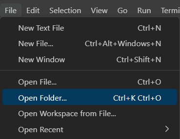
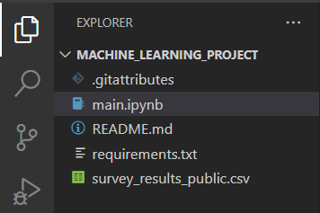
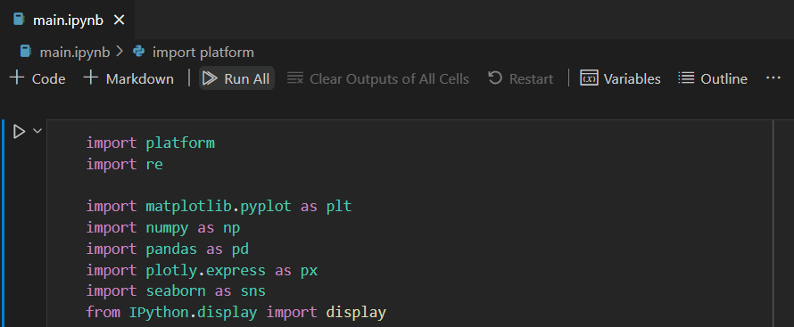
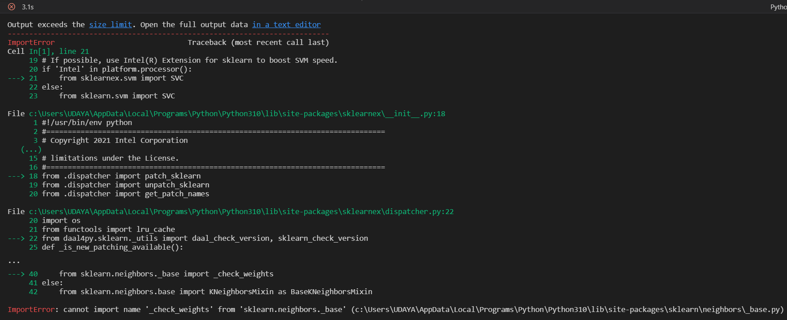
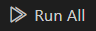
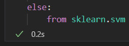

# Installation Instructions #

Software Requirements:
* Optimized for computers with Intel-based processors (Intel is not needed, however).
* Should be compatible with any Unix-based operating system, but oriented towards Windows.
* If using Linux, make sure to use the command `pip3` instead of `pip` in the instructions below.

Prerequsites:
* [Python](https://www.python.org/downloads/) `>= 3.10`
* [Jupyter](https://jupyter.org/install)
* [Visual Studio Code](https://code.visualstudio.com/) (make sure to check off "Add to PATH")
* [Python extension for Visual Studio Code](https://marketplace.visualstudio.com/items?itemName=ms-python.python)

The following 4-minute tutorial can help with installing prerequisites: https://youtu.be/h1sAzPojKMg

Once prerequisites are met, download this repository via:
```
git clone https://github.com/Udaya-X2/machine_learning_project
```

Change directories and install the required dependencies:
```
cd machine_learning_project
pip install -r requirements.txt
```

Open Visual Studio Code in the directory:
```
code .
```

(If the above does not work, you can also open Visual Studio Code and navigate to `machine_learning_project` manually)



Open `main.ipynb`:



Click "Run All":



Don't worry if you get an `ImportError` at first.



Select "Run All" again, and the code should work:





# Project Guidelines #

## 1. Choose a classification problem ##

* Find a classification problem that is interesting to you.
* Either find a sufficient number of training examples or you generate them.
* Do not choose a problem with a single training feature.
* Discuss what is the output feature that you will learn, what are the input features that you will use, and why you think they are related.
* Maybe you don’t have obvious training features, but you need to generate them by processing some data. Discuss it.

## 2. Analyze how the training data is distributed ##

* Look at how the values in your training features are distributed. Do you need feature scaling?
* Look at how correlated are your features. If some of them are highly correlated, you may consider filtering out redundant features.
* Use visualization tools to document your work (box plots, histograms, etc).
* If you have way too many features, you may benefit from some feature selection. Discuss how you reduced the number of features.

## 3. Apply machine learning algorithms and tune them ##

Work on applying at least one of the following algorithms on your dataset.
* Logistic regression
* Support vector machine
* Neural networks

Tune your parameters:
* Randomly separate the data into training, validation and test sets.
* Tune the parameters in these algorithms using the validation set. Show us how you decided.

## 4. Produce alternative models ##

* To improve your model, consider using more data features or less data features.
* You can increase the features by generating derivative features (polynomial or multiplicative). You can decrease them by eliminating features based on some rationale.
* Or instead of changing the features used, you can consider applying an alternative learning method to your problem.
* Tune the hyperparameters of alternative settings just like you tuned the original one.

## 5. Learning curve ##

* For each learning setting, generate a learning curve and decide if you can benefit from collecting more training examples.
* Comment on the quality of the fit for each model (underfit / overfit) and demonstrate your reasons.

## 6. Analyze your success ##

* Execute each method on the same test data, and compare their ROC curves and their AUC.
* Calculate your precision and recall.
* Compare the errors that these methods make. Put those errors in a Venn diagram so that we can see if the methods make similar errors.
* Select some sample errors and comment on why they are misclassified.

## 7. Communicate your results ##

As a result of your project, you need to prepare the following.
* Your code along with your inputs and outputs, and instructions to reproduce your results
* A 10 minutes presentation for the class
* A report as a PDF file. Make sure it has the following sections:
    * Description of the problem and the data
    * Parameter tuning with charts
    * Generation and tuning of alternative models
    * Learning curve analysis
    * Performance and error analysis

# References #

Stack Overflow Developer Survey 2022. (2022, June 22). Stack Overflow. https://survey.stackoverflow.co/2022/

Dataset can be downloaded from [here](https://info.stackoverflowsolutions.com/rs/719-EMH-566/images/stack-overflow-developer-survey-2022.zip) (also included here as [survey_results_public.csv](survey_results_public.csv)).

All survey data from 2011 and beyond can be downloaded from [here](https://insights.stackoverflow.com/survey/).
